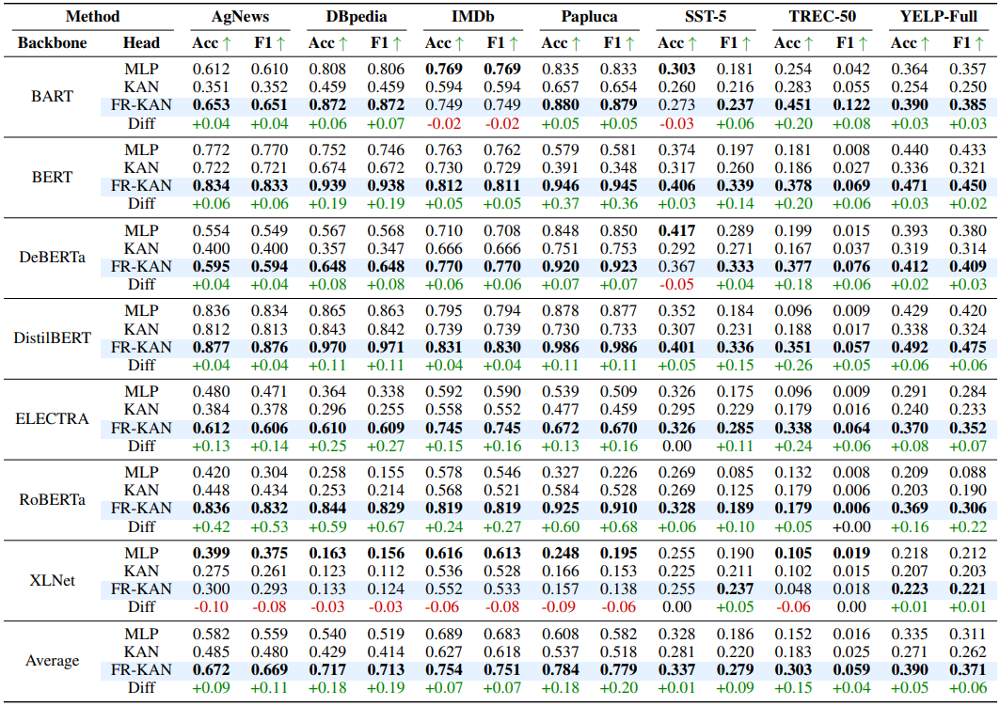

<div align="center">

# FourierKAN outperforms MLP on Text Classification Head Fine-tuning

</div>

<p align="center">
  <a href="https://imranabdullah.com"><strong>Abdullah Al Imran*</strong></a>
  and
  <a href="https://farhanishmam.github.io/"><strong>Md Farhan Ishmam*</strong></a>
</p>

<div align="center">


[](https://arxiv.org/abs/2408.08803)
[](https://github.com/abdalimran/FR-KAN-Text-Classification)

</div>

---

**TLDR:** FourierKAN (FR-KAN) is a variant of the MLP alternative, Kolmogorov-Arnold Networks (KANs), using the Fourier series as the basis function. Using Fourier-KAN classification heads during linear probing, gives an average increase of 10% in accuracy and 11% in F1-score over MLPs on pre-trained language models. FR-KAN heads also train faster and require fewer parameters.

## Installation

Create a virtual environment and install all the dependencies. Ensure that you have `Python 3.8` or higher installed.

```
pip install -r requirements.txt
```

## Notebooks
- The experimental results on every model and dataset can be reproduced following the notebooks in `notebooks_experiments`. 
- To conduct ablations on the parameter count of the best-performing models and the grid size, follow the notebooks in `notebooks_ablation`.
- For overall result generation, run `results.ipynb`.
- To reproduce the visualizations in our work, run `visualization.ipynb`. 

## Performance Evaluation

We evaluated the performance of seven models on seven text classification datasets based on accuracy and F1 score.



## Citation

If you find our work useful, please cite our paper:
```
@inproceedings{al2024fourierkan,
  title={FourierKAN outperforms MLP on Text Classification Head Fine-tuning},
  author={Al Imran, Abdullah and Ishmam, Md Farhan},
  booktitle={NeurIPS 2024 Workshop on Fine-Tuning in Modern Machine Learning: Principles and Scalability}
}
```
