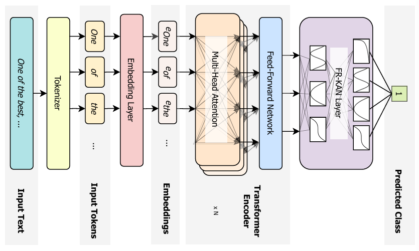

<div align="center">

# Leveraging FourierKAN Classification Head for Pre-Trained Transformer-based Text Classification

</div>

<p align="center">
  <a href="https://imranabdullah.com"><strong>Abdullah Al Imran*</strong></a>
  ·
  <a href="https://farhanishmam.github.io/"><strong>Md Farhan Ishmam*</strong></a>
</p>

<div align="center">

[](https://arxiv.org/abs/2408.08803)

[](https://github.com/abdalimran/FR-KAN-Text-Classification)

</div>

---

We introduce FourierKAN (FR-KAN), a variant of the promising MLP alternative called Kolmogorov-Arnold Networks (KANs), as classification heads for transformer-based encoders. Our studies reveal an average increase of 10% in accuracy and 11% in F1-score when incorporating FR-KAN heads instead of traditional MLP heads for several transformer-based pre-trained models across multiple text classification tasks. FR-KAN heads also train faster and require fewer parameters. 

## Methodology Overview



We propose feature-based fine-tuning of the FR-KAN classification head with different transformer-based pre-trained language models. 

## Performance Evaluation

We evaluated the performance of seven models on seven text classification datasets based on accuracy and F1 score.


## Installation

Create a virtual environment and install all the dependencies. Ensure that you have `Python 3.8` or higher installed.

```
pip install -r requirements.txt
```

## Notebooks
- The experimental results on every model and dataset can be reproduced following the notebooks in `notebooks_experiments`. 
- To conduct ablations on the parameter count of the best-performing models and the grid size, follow the notebooks in `notebooks_ablation`.
- For overall result generation, run `results.ipynb`.
- To reproduce the visualizations in our work, run `visualization.ipynb`. 

## Citation

If you find our work useful, please cite our paper:
```
@misc{imran2024leveragingfourierkanclassificationhead,
      title={Leveraging FourierKAN Classification Head for Pre-Trained Transformer-based Text Classification}, 
      author={Abdullah Al Imran and Md Farhan Ishmam},
      year={2024},
      eprint={2408.08803},
      archivePrefix={arXiv},
      primaryClass={cs.CL},
      url={https://arxiv.org/abs/2408.08803}, 
}
```

